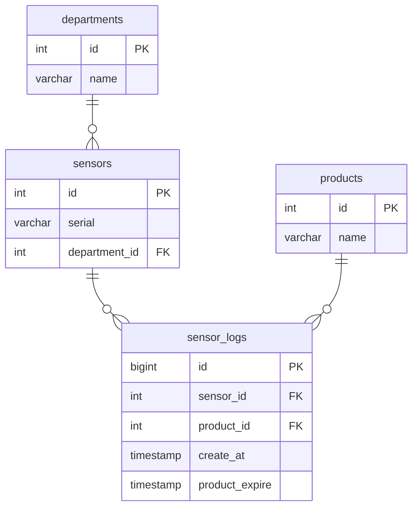

# pipeline_test
This project is part of the Data Engineer assessment for Data Wow. 
It shows an end-to-end pipeline using Mage.ai for orchestration and PostgreSQL for storage, with synthetic data generated into Parquet files.

## Project Structure
```
pipeline_test/
├─ data_sample/            # .parquet files
├─ mage/                   # Mage project (pipelines)
├─ sql/
│  └─ schema.sql           # database DDL
├─ .env                    # environment variables for docker-compose
├─ docker-compose.yml
├─ README.md
├─ requirements.txt        # libs
└─ sampledata.py           # generates synthetic parquet files into data_sample/
```

## Tools
This project uses **Docker** to run the services:
- **Mage.ai** — pipeline UI (http://localhost:6789)
- **PostgreSQL** — database (localhost:5432)
- **Adminer** *(optional)* — web SQL client (http://localhost:8080)

## Dataset Overview
This project uses **synthetic data** generated by `sampledata.py`.  
The generator produces **43,201** Parquet files, each with **~1,900** records, saved under `data_sample/`. 

**Fields**
- `department_name`
- `sensor_serial`
- `product_name`
- `create_at`
- `product_expire`

The pipeline ingests these files, normalizes (see [Database Diagram](#database-diagram)) , and loads the results into PostgreSQL.

## Database Diagram


## Quick Start

- **Prepare data sample**
  *Requires Python lib*
  ```bash
  pip install -r requirements.txt
  python sampledata.py
  ```

*This generates .parquet files in data_sample/ folder)

- **Start services by docker**
  - *Requires to change env file to .env before run docker*
  ```bash
  docker compose up -d
  ```

- **Run the pipeline**
  - Open Mage UI (Mage UI: http://localhost:6789)
  - Run blocks in order:
    - data_loader -> reads data_sample/
    - transformer -> normalizes data
    - data_exporter -> used sql/schema.sql and loads to Postgres

- **Check Postgres**
  - Open Adminer (http://localhost:8080) *Check credentials in .env*

## Limitations
  - The current code may not finish reading all **43,201** files. (performance optimization required)

## Author
  Visutinee Haruethaithanasan

